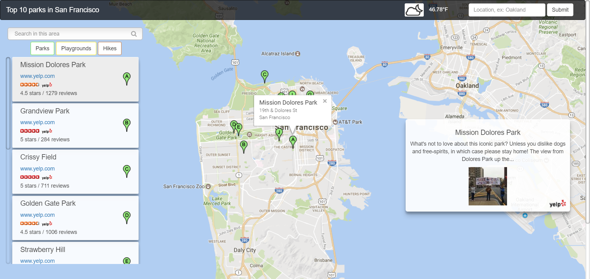
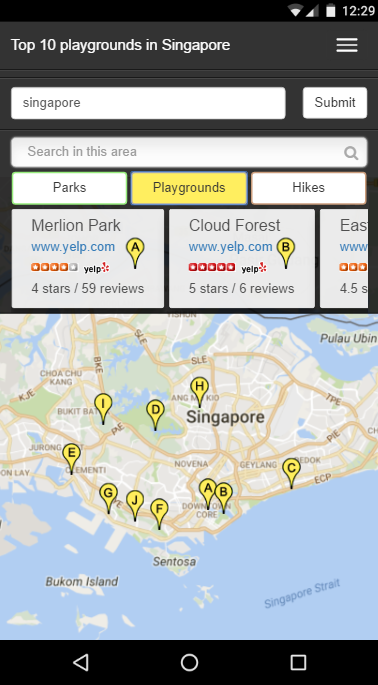

# Neighborhood_map

This application was created as my submission for the **project 6** of [Udacity's Full Stack NanoDegree program](https://www.udacity.com/course/full-stack-web-developer-nanodegree--nd004).

##Project Description: 

This is an **interactive map** of the most popular parks, playgrounds or hikes in the neighborhood of your choice based on yelp reviews.

###Note:
The app is **mobile friendly** but you will get the full experience and have access to more feature on a desktop.

##Feature:
- A weather icon and the temperature of the current neighborhood is displayed on the navbar (not available for mobile phone).
- You can choose to display the top 10 parks, playgrounds or hikes by clicking on the appropriate button.
- The places can be filtered by typing a name in the search input 
- A clickable list of the places is available which show the details about the places.
- When you click on a marker it will open an info window that shows the address of the places selected.

##Resources:

- Udacity Supporting Courses: [JavaScript Design Patterns](https://www.udacity.com/course/javascript-design-patterns--ud989) and [Intro to AJAX](https://www.udacity.com/course/intro-to-ajax--ud110)
- [The Complete JavaScript Course: Build a Real-World Project](https://www.udemy.com/the-complete-javascript-course/learn/v4/overview)
- [Bootstrap](http://getbootstrap.com/getting-started/)
- [Knockout.js documentation](http://knockoutjs.com/documentation/introduction.html)
- [Google Map API](https://developers.google.com/maps/)
- [Yelp API](https://www.yelp.com/developers/documentation/v2/overview)
- [Dark Sky API](https://darksky.net/dev/)
- [Simple weather icons](http://www.danvierich.de/weather/) by Daniel Vierich
- Colored Markers by [benjaminkeen](http://www.benjaminkeen.com/google-maps-coloured-markers/)
- OAuth 1.0a signature generator by [bettiolo](https://github.com/bettiolo/oauth-signature-js)
- Udacity forum
- Stack overflow

##Screenshots

  
  

